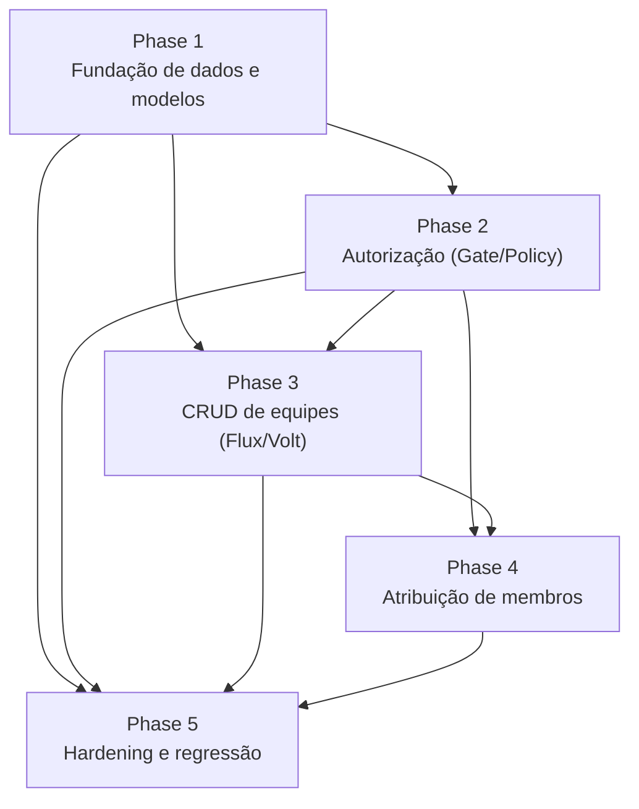

# Roadmap: pnsl-ntm — Marco v1.1 Gestão de Equipes VEM (Fundação)

**Defined:** 2026-04-21
**Milestone:** v1.1 — Gestão de Equipes VEM (Fundação)
**Granularity:** standard (5 fases)
**Coverage:** 43/43 requisitos mapeados

## Overview

Este marco estabelece a fundação da gestão de equipes VEM: introduz um RBAC escopado por equipe (pivot `equipe_usuario` + Gate/Policy nativos do Laravel) coexistindo com o `users.role` flat legado; cria a estrutura de 11 equipes VEM (migrations + models + seeder + CRUD Volt/Flux); e habilita a coordenação geral a atribuir membros e coordenadores H/M às equipes. O progresso é em cinco fases em ordem de dependência: DB/models → autorização → CRUD → atribuição → hardening/regressão. Ao final, todas as 24 Feature + 3 Unit tests legadas continuam verdes, `pint --test` passa sem diff, e a base está pronta para os marcos v1.2+ (Espaços, Score 0-100, Vendinha, IA).

## Milestones

- [x] **v1.0 MVP** — Base em produção (Pessoas, Fichas VEM/ECC/SGM, Eventos, Presenças, Gamificação, PWA, deploy FTP)
- [ ] **v1.1 Gestão de Equipes VEM (Fundação)** — Phases 1-5 (em andamento)
- [ ] **v1.2 Espaços de Equipe + Presenças + Crachás** — diferido (eventos internos de equipe, registro de presença → score, crachás padronizados)
- [ ] **v1.3 Gamificação Score 0-100** — diferido (rubrica thinkworklab)
- [ ] **v1.4 Módulo Vendinha** — diferido
- [ ] **v1.5 Análise de IA para Vendinha** — diferido

## Phases

**Phase Numbering:**
- Integer phases (1, 2, 3, 4, 5): trabalho planejado do marco v1.1
- Decimal phases (ex.: 2.1): inserções urgentes, caso necessárias (marcadas com INSERTED)

- [ ] **Phase 1: Fundação de dados e modelos de equipe** — Migrations, models, enum de papéis e seeder das 11 equipes VEM
- [ ] **Phase 2: Autorização escopada (Gate/Policy nativos)** — `EquipePolicy`, helpers no `User`, wiring em `AuthServiceProvider`, coexistência com middleware `manager`
- [ ] **Phase 3: CRUD de equipes (Flux/Volt)** — FormRequests, Volt SFCs de listagem/criação/edição, rotas, arquivamento soft-delete
- [ ] **Phase 4: Atribuição de membros e coordenadores** — Volt `equipes.atribuir`, filtros VEM + sexo, regras H+M, log de auditoria, listagem no perfil
- [ ] **Phase 5: Hardening, regressão e qualidade** — Cobertura Pest ≥80%, regressão da suite legada, preservação da cascata User↔Pessoa e do `GamificacaoObserver`, CI verde

## Phase Details

### Phase 1: Fundação de dados e modelos de equipe

**Goal**: Persistir a estrutura de equipes e vínculos no banco, com models e seeder prontos para uso a jusante; `php artisan migrate:fresh --seed` produz 11 equipes VEM em SQLite e MySQL.

**Depends on**: Nothing (fase fundacional do marco)

**Requirements**: RBAC-01, RBAC-02, RBAC-03, RBAC-04, RBAC-05, RBAC-06, EQUIPE-01, EQUIPE-02, EQUIPE-03, MIG-04, TEST-05, TEST-06

**Success Criteria** (what must be TRUE):
  1. Após `php artisan migrate:fresh --seed`, a tabela `equipes` contém exatamente 11 registros com `idt_movimento = VEM` (sala, limpeza, reportagem, oração, vendinha, alimentação, emaús, secretaria, troca de ideias, recepção, bandinha)
  2. A tabela `equipe_usuario` existe com FKs (`user_id`, `equipe_id`), coluna `papel`, colunas de auditoria (`usr_inclusao`, `dat_inclusao`, `usr_alteracao`, `dat_alteracao`), soft deletes, e unique constraint `(user_id, equipe_id)`
  3. O enum de papéis (`coord-geral`, `coord-equipe-h`, `coord-equipe-m`, `membro-equipe`) é acessível em classe dedicada e usado como cast do campo `papel` no model pivot `EquipeUsuario`
  4. `Equipe::paraMovimento($idt)` e `Equipe::ativas()` retornam coleções corretas; `$user->equipes` retorna `belongsToMany` com `withPivot('papel')` e `withTimestamps()`; `$equipe->usuarios()`, `$equipe->coordenadores()` e `$equipe->membros()` filtram pelo `papel`
  5. `php artisan migrate:fresh` + `php artisan migrate:rollback` executa em SQLite (dev/CI) e MySQL (prod-like) sem orfanar FKs, e o teste Pest cobrindo o seed conta 11 equipes VEM com os nomes esperados

**Plans**: TBD

**Artifacts**:
- `database/migrations/YYYY_MM_DD_HHMMSS_create_equipes_table.php`
- `database/migrations/YYYY_MM_DD_HHMMSS_create_equipe_usuario_table.php`
- `app/Enums/PapelEquipe.php` (ou `app/Support/PapelEquipe.php`)
- `app/Models/Equipe.php`
- `app/Models/EquipeUsuario.php` (pivot)
- `database/seeders/EquipeVEMSeeder.php` (ou extensão do `DominiosSeeder`)
- `database/factories/EquipeFactory.php`, `database/factories/EquipeUsuarioFactory.php`
- `tests/Feature/Database/EquipeMigrationTest.php`
- `tests/Feature/Database/EquipeVEMSeederTest.php`
- Atualização de `App\Models\User::equipes()` (relacionamento)

**Risks**:
- **Mutator de slug**: slugificação precisa ser determinística e tolerante a acentos ("oração", "troca de ideias") e colisão com `unique:equipes,slug`; testar com `Str::slug` + normalização NFC
- **Constraint unique em soft-deleted rows**: em SQLite, `unique(user_id, equipe_id)` pode colidir com vínculos soft-deletados; avaliar índice parcial ou composto incluindo `deleted_at` conforme driver
- **Compatibilidade MySQL ↔ SQLite**: tipos de coluna (enum string vs check constraint), timestamps default, e FKs com `onDelete` devem funcionar em ambos drivers; validar via `TEST-05`
- **Helper `createMovimentos()` em `tests/Pest.php`** já menciona 11 equipes — alinhar seeder com esse helper ou refatorá-lo

---

### Phase 2: Autorização escopada (Gate/Policy nativos)

**Goal**: Introduzir autorização baseada em `EquipePolicy` e helpers no `User` sem regredir o middleware `manager` legado; `coord-geral` coexiste com `users.role ∈ {admin, coord}` e toda rota `configuracoes.*` continua protegida como antes.

**Depends on**: Phase 1 (models e enum de papéis precisam existir)

**Requirements**: RBAC-07, RBAC-08, RBAC-09, RBAC-10, MIG-01, MIG-02, MIG-03, TEST-02, TEST-03, TEST-07

**Success Criteria** (what must be TRUE):
  1. `EquipePolicy` existe com habilidades `viewAny`, `view`, `update`, `assignMembers` e é registrada em `App\Providers\AuthServiceProvider::$policies` (provider criado se ainda não existir)
  2. `$user->isCoordenadorGeral()`, `$user->isCoordenadorDe($equipe)` e `$user->isMembroDe($equipe)` retornam booleans corretos com base na pivot `equipe_usuario`
  3. Nenhuma migration do marco altera o schema de `users.role`; `users.role ∈ {admin, coord, user}` continua populado e `coord-geral` convive como papel adicional via pivot (não coluna)
  4. `OnlyManagerMiddleware` (alias `manager`) continua retornando 403 para `role = user` e liberando `configuracoes.*` para `role ∈ {admin, coord}` — smoke test Pest verde
  5. Unit tests da `EquipePolicy` cobrem as 4 habilidades (cenários autorizado/negado para `coord-geral`, `coord-equipe-h/m`, `membro-equipe`, não-membro); Feature tests mostram que `membro-equipe` e `user` recebem 403 ao acessar endpoints protegidos pela policy

**Plans**: 2 plans

Plans:
- [ ] 02-01-PLAN.md — EquipePolicy + AuthServiceProvider + User helpers (isCoordenadorGeral/De/Membro)
- [ ] 02-02-PLAN.md — Testes Unit/Feature da policy + smoke test OnlyManagerMiddleware

**Artifacts**:
- `app/Policies/EquipePolicy.php`
- `app/Providers/AuthServiceProvider.php` (novo, registrando `$policies`)
- `bootstrap/providers.php` (registro do `AuthServiceProvider` se necessário)
- Helpers em `app/Models/User.php` (`isCoordenadorGeral`, `isCoordenadorDe`, `isMembroDe`)
- `tests/Unit/Policies/EquipePolicyTest.php`
- `tests/Feature/Autorizacao/ConfiguracoesLegacyGuardTest.php` (smoke regressão `OnlyManagerMiddleware`)
- `tests/Feature/Autorizacao/EquipePolicyHttpTest.php`

**Risks**:
- **Coexistência Gate + middleware legado**: rotas novas devem usar `->can('...')` ou `authorize` no controller/Volt, enquanto `configuracoes.*` continua no middleware `manager`; documentar o contrato para evitar "double-gating"
- **Descoberta automática de Policy**: Laravel 12 tenta auto-discover; registrar explicitamente em `$policies` para blindar contra renomeação do model
- **`coord-geral` em múltiplas equipes**: semântica precisa ser clara — é um papel global (um vínculo em qualquer equipe VEM basta) ou por equipe? Decisão: é atribuído via pivot mas as habilidades tratam como flag global (ver ATRIB-01); documentar na policy
- **`AuthServiceProvider` ainda não existe no projeto**: criar provider novo e registrá-lo em `bootstrap/providers.php` sem quebrar o boot atual (`AppServiceProvider`, `VoltServiceProvider`)

---

### Phase 3: CRUD de equipes (Flux/Volt)

**Goal**: Coordenação geral consegue listar, criar, editar, ativar/desativar e arquivar (soft-delete) equipes via UI Volt/Flux, com validação por `FormRequest` e autorização pela `EquipePolicy`.

**Depends on**: Phase 2 (policy e helpers precisam existir para guardar as rotas)

**Requirements**: EQUIPE-04, EQUIPE-05, EQUIPE-06, EQUIPE-07, EQUIPE-09, EQUIPE-10

**Success Criteria** (what must be TRUE):
  1. `coord-geral` logado acessa `/equipes` e vê a lista de equipes filtrada pelo seu `idt_movimento` (= VEM neste marco); a tela usa Flux components coerentes com o resto da UI
  2. `coord-geral` consegue criar uma nova equipe com `nome` (≤60), `slug` único (auto-gerado se omitido) e `descricao` (≤500), e o registro persiste corretamente
  3. `coord-geral` consegue editar uma equipe existente e alternar o campo `ativo` entre true/false, afetando `Equipe::ativas()`
  4. Usuários sem papel `coord-geral` (ex.: `coord-equipe-h`, `membro-equipe`, `user`) recebem 403 ao acessar `equipes.create`, `equipes.edit` ou rotas de escrita; `membros` da equipe podem apenas ler (`equipes.index`/`equipes.show`)
  5. Arquivar equipe aplica `SoftDeletes` preservando registros em `equipe_usuario` (histórico intacto) e a equipe pode ser restaurada

**Plans**: 4 planos

Plans:
- [ ] 03-01-PLAN.md — EquipeStoreRequest + EquipeUpdateRequest (FormRequests com validação escopada)
- [ ] 03-02-PLAN.md — Rotas equipes.* + Volt SFC equipes.index (listagem, arquivar, restaurar)
- [ ] 03-03-PLAN.md — Volt SFC equipes.create + equipes.edit (formulários de criação/edição)
- [ ] 03-04-PLAN.md — Feature tests EquipeCrudTest + EquipeArquivamentoTest + EquipeHMValidationTest

**Artifacts**:
- `app/Http/Requests/EquipeStoreRequest.php`
- `app/Http/Requests/EquipeUpdateRequest.php`
- `resources/views/livewire/equipes/index.blade.php` (Volt SFC)
- `resources/views/livewire/equipes/create.blade.php` (Volt SFC)
- `resources/views/livewire/equipes/edit.blade.php` (Volt SFC)
- Rotas `equipes.*` em `routes/web.php` dentro do grupo `auth` com `->can()`
- `tests/Feature/Equipes/EquipeCrudTest.php`
- `tests/Feature/Equipes/EquipeArquivamentoTest.php`
- `tests/Feature/Equipes/EquipeHMValidationTest.php`

**UI hint**: yes

**Risks**:
- **Flux Free vs Pro**: verificar que todos os componentes usados estão no `livewire/flux` Free (projeto não tem Pro); fallback para Blade custom se necessário
- **Escopo por movimento**: `idt_movimento = VEM` vem do usuário logado OU é fixo do marco? Decisão: vem do usuário logado; rotas herdam isso via `Equipe::paraMovimento($user->idt_movimento)` — ainda que o marco seja VEM-only, manter a arquitetura escopada prepara v1.2+
- **Slug colidindo após arquivamento**: se equipe "oração" é soft-deletada e criada de novo, `unique:equipes,slug` falha; usar `unique(equipes.slug)->ignore(null, 'deleted_at')` ou slug+id
- **Volt SFC + FormRequest**: FormRequests são HTTP-bound; em Volt, a validação é feita via `rules()` dentro do componente. Manter `FormRequest` apenas se houver endpoint HTTP clássico; caso contrário, espelhar as rules no Volt e cobrir ambos em teste

---

### Phase 4: Atribuição de membros e coordenadores

**Goal**: Coordenação geral consegue atribuir, trocar papel e remover membros/coordenadores de cada equipe pela UI, respeitando os filtros de movimento/sexo e o limite H+M; o perfil da `Pessoa` passa a listar as equipes às quais pertence.

**Depends on**: Phase 3 (CRUD de equipes em produção) e Phase 2 (policy)

**Requirements**: EQUIPE-08, ATRIB-01, ATRIB-02, ATRIB-03, ATRIB-04, ATRIB-05, ATRIB-06, ATRIB-07, ATRIB-08, TEST-04

**Success Criteria** (what must be TRUE):
  1. `coord-geral` acessa `/equipes/{equipe}/atribuir`; qualquer outro papel recebe 403 via Gate/Policy
  2. A listagem de pessoas elegíveis filtra por `idt_movimento = VEM`; quando o slot alvo é `coord-equipe-h` ou `coord-equipe-m`, filtra adicionalmente por sexo masculino/feminino na `Pessoa` vinculada
  3. As três ações (Atribuir, Alterar papel, Remover) funcionam end-to-end: criam/atualizam/soft-deletam linha em `equipe_usuario` e preenchem `usr_inclusao`/`dat_inclusao` ou `usr_alteracao`/`dat_alteracao` com o ID e timestamp do usuário autenticado
  4. Tentar atribuir um 2º `coord-equipe-h` (ou 2º `coord-equipe-m`) à mesma equipe retorna erro de validação com mensagem clara em pt_BR, sem criar o registro (EQUIPE-08 + ATRIB-06; Feature test cobre `TEST-04`)
  5. O perfil da pessoa (`settings.profile` ou página equivalente) exibe a lista "Equipes" com nome da equipe + papel atual; soft-deletes na pivot não aparecem (apenas vínculos ativos)

**Plans**: TBD

**Artifacts**:
- `resources/views/livewire/equipes/atribuir.blade.php` (Volt SFC)
- Atualização em `resources/views/livewire/settings/profile.blade.php` (ou Blade equivalente) para a lista de equipes
- Rota `equipes.atribuir` em `routes/web.php`
- Ações/métodos do Volt: `atribuir()`, `alterarPapel()`, `remover()` com guard via Gate
- Atualização de `app/Models/EquipeUsuario.php` com `booted()` para preencher auditoria (ou listener/observer)
- `tests/Feature/Equipes/AtribuirMembroTest.php`
- `tests/Feature/Equipes/BloqueioHMRuntimeTest.php`
- `tests/Feature/Equipes/AuditoriaPivotTest.php`

**UI hint**: yes

**Risks**:
- **Runtime H+M vs DB constraint**: a restrição "máx 1 coord-equipe-h + 1 coord-equipe-m" é difícil de expressar em unique constraint puro; implementar via `FormRequest` rule + verificação Eloquent em transação para evitar race; cobrir com teste concorrente (ou ao menos dois requests sequenciais)
- **Filtro por sexo depende de `Pessoa`**: `users` não tem sexo diretamente; precisa `$user->pessoa->sexo`; validar que todos os `User` VEM têm `Pessoa` (cascata de `User::boot`) e que o seed/factory preenchem sexo
- **Auditoria redundante com timestamps do Laravel**: `usr_inclusao/dat_inclusao/usr_alteracao/dat_alteracao` são campos de negócio (histórico); manter separados dos `created_at/updated_at` do Eloquent para não confundir soft-delete + logs
- **Contexto de request em observer**: preencher `usr_alteracao` exige `Auth::id()` — garantir que o listener/observer roda dentro de request autenticado; em CLI (seeder), usar default `null` ou user do sistema

---

### Phase 5: Hardening, regressão e qualidade

**Goal**: Suite Pest completa (nova + legada) passa verde, cobertura ≥80% em todo código novo, `vendor/bin/pint --test` passa sem diff, e nenhum comportamento pré-existente (cascata `User↔Pessoa` + `BoasVindasMail`, `GamificacaoObserver`, `OnlyManagerMiddleware`) regride.

**Depends on**: Phases 1-4 (todo o código do marco precisa estar em place)

**Requirements**: MIG-05, MIG-06, MIG-07, TEST-01, TEST-08

**Success Criteria** (what must be TRUE):
  1. `./vendor/bin/pest` executa 100% verde, incluindo as ~24 Feature + 3 Unit tests legadas (zero regressão) e os novos testes introduzidos nas Phases 1-4
  2. Coverage report (via `analyze-coverage.ps1` ou relatório HTML/XML do PHPUnit) mostra ≥80% de cobertura nos arquivos criados em `app/Models/Equipe*`, `app/Policies`, `app/Http/Requests/Equipe*` e novos Volt SFCs (onde testável)
  3. `vendor/bin/pint --test` passa sem diff; CI `.github/workflows/deploy.yml` job "Lint" fica verde no PR/commit do marco
  4. Teste de regressão da cascata onboarding: criar `User` dispara `Pessoa::saveQuietly()`; criar `Pessoa` dispara `User` + `BoasVindasMail` com senha DDMMYYYY — ambos continuam verdes (teste explícito `tests/Feature/Onboarding/CascadeUserPessoaTest.php`)
  5. Teste de regressão do `GamificacaoObserver`: inserir `Gamificacao` incrementa `pessoa.qtd_pontos_total`; soft-delete decrementa — observer permanece registrado em `AppServiceProvider::boot()` e continua funcionando idêntico ao v1.0

**Plans**: TBD

**Artifacts**:
- `tests/Feature/Onboarding/CascadeUserPessoaTest.php` (regressão explícita MIG-05)
- `tests/Feature/Gamificacao/GamificacaoObserverRegressaoTest.php` (regressão MIG-06)
- Ajustes de coverage (testes extras para cobrir ramos não exercidos nas Phases 1-4)
- Rodada de `vendor/bin/pint` para normalizar estilo antes do `--test`
- Revisão de `App\Providers\AppServiceProvider::boot()` confirmando registro do `GamificacaoObserver` intacto

**Risks**:
- **Coverage threshold em Volt SFCs**: Volt SFCs são testados via `Livewire::test()`; garantir que `phpunit.xml` inclui o path dos componentes no coverage ou assumir exceção documentada
- **Pint diff em arquivos novos**: rodar `pint` localmente antes do push para evitar CI vermelho por questão de formatação de um arquivo novo
- **Flakiness em testes de mail síncrono**: `BoasVindasMail` é `send()` inline; no teste usar `Mail::fake()` para assertar dispatch sem enviar de verdade
- **Testing DB dual-driver**: suite roda em SQLite (`database/testing.sqlite`), mas `TEST-05` pede regressão em MySQL; documentar procedimento local (`DB_CONNECTION=mysql php artisan test`) mesmo que CI rode só em SQLite

---

## Dependency Diagram

**Execution order:** 1 → 2 → 3 → 4 → 5 (phase 5 é gate final de qualidade e pode absorver pequenas correções descobertas nas phases anteriores).

---

## Traceability

Mapeamento completo dos 43 requisitos v1 para as fases do roadmap.

| Requirement | Phase | Status |
|-------------|-------|--------|
| RBAC-01 | Phase 1 | Pending |
| RBAC-02 | Phase 1 | Pending |
| RBAC-03 | Phase 1 | Pending |
| RBAC-04 | Phase 1 | Pending |
| RBAC-05 | Phase 1 | Pending |
| RBAC-06 | Phase 1 | Pending |
| RBAC-07 | Phase 2 | Pending |
| RBAC-08 | Phase 2 | Pending |
| RBAC-09 | Phase 2 | Pending |
| RBAC-10 | Phase 2 | Pending |
| EQUIPE-01 | Phase 1 | Pending |
| EQUIPE-02 | Phase 1 | Pending |
| EQUIPE-03 | Phase 1 | Pending |
| EQUIPE-04 | Phase 3 | Pending |
| EQUIPE-05 | Phase 3 | Pending |
| EQUIPE-06 | Phase 3 | Pending |
| EQUIPE-07 | Phase 3 | Pending |
| EQUIPE-08 | Phase 4 | Pending |
| EQUIPE-09 | Phase 3 | Pending |
| EQUIPE-10 | Phase 3 | Pending |
| ATRIB-01 | Phase 4 | Pending |
| ATRIB-02 | Phase 4 | Pending |
| ATRIB-03 | Phase 4 | Pending |
| ATRIB-04 | Phase 4 | Pending |
| ATRIB-05 | Phase 4 | Pending |
| ATRIB-06 | Phase 4 | Pending |
| ATRIB-07 | Phase 4 | Pending |
| ATRIB-08 | Phase 4 | Pending |
| MIG-01 | Phase 2 | Pending |
| MIG-02 | Phase 2 | Pending |
| MIG-03 | Phase 2 | Pending |
| MIG-04 | Phase 1 | Pending |
| MIG-05 | Phase 5 | Pending |
| MIG-06 | Phase 5 | Pending |
| MIG-07 | Phase 5 | Pending |
| TEST-01 | Phase 5 | Pending |
| TEST-02 | Phase 2 | Pending |
| TEST-03 | Phase 2 | Pending |
| TEST-04 | Phase 4 | Pending |
| TEST-05 | Phase 1 | Pending |
| TEST-06 | Phase 1 | Pending |
| TEST-07 | Phase 2 | Pending |
| TEST-08 | Phase 5 | Pending |

**Coverage:**
- Total v1 requirements: **43** (10 RBAC + 10 EQUIPE + 8 ATRIB + 7 MIG + 8 TEST)
- Mapped to phases: **43**
- Unmapped: **0** ✓
- Phases: **5** (1: 12 reqs · 2: 10 reqs · 3: 7 reqs · 4: 9 reqs · 5: 5 reqs)

---

## Progress

**Execution Order:** Phase 1 → Phase 2 → Phase 3 → Phase 4 → Phase 5

| Phase | Milestone | Plans Complete | Status | Completed |
|-------|-----------|----------------|--------|-----------|
| 1. Fundação de dados e modelos | v1.1 | 0/TBD | Not started | - |
| 2. Autorização escopada (Gate/Policy) | v1.1 | 0/2 | Planned | - |
| 3. CRUD de equipes (Flux/Volt) | v1.1 | 0/TBD | Not started | - |
| 4. Atribuição de membros e coordenadores | v1.1 | 0/TBD | Not started | - |
| 5. Hardening, regressão e qualidade | v1.1 | 0/TBD | Not started | - |

---

*Roadmap generated: 2026-04-21*
*Covers milestone v1.1 — Gestão de Equipes VEM (Fundação). Marcos v1.2+ (Espaços, Score 0-100, Vendinha, IA) são v2 Requirements em REQUIREMENTS.md e serão roadmappeados em marcos futuros.*

---

## v1.2 Scope Preview — Espaços de Equipe + Presenças + Crachás

> Expandido em 2026-04-23. Roadmap detalhado será gerado após conclusão de v1.1.

### Feature A — Eventos Internos de Equipe
- Coordenador de equipe cria evento interno (reunião, ensaio, etc.) no espaço da sua equipe
- Campos: nome, data, tipo, descrição
- Modelo proposto: `equipe_evento` (FK: `equipe_id`, `user_id` criador)

### Feature B — Registro de Presença em Eventos de Equipe
- Coordenador registra presença dos membros da sua equipe no evento criado
- Presença alimenta diretamente o score de gamificação do membro
- Modelo proposto: `equipe_evento_presenca` (FK: `equipe_evento_id`, `user_id`, `ind_presente`, `registrado_por`)
- Integração: ao marcar presença → `Gamificacao::create()` ou disparo de evento/observer
- Dados já existentes: `Presenca` legada para eventos principais continua intacta

### Feature C — Sistema de Crachás (Badges)
- UI Volt/Flux para geração de crachás de trabalhadores do evento
- Tamanho padronizado: 85,6mm × 54mm (cartão de crédito) ou A4 (6 por página)
- **Dados que já existem no schema** (sem nova migration necessária):
  - `tip_cor_troca` → `participante.tip_cor_troca` (cor da troca do evento)
  - Alergias → `pessoa_saude` + `tipo_restricao` (ja mapeado no schema)
  - Casais → `nom_conjuge` + `nom_apelido_conjuge` (ficha VEM/ECC/SGM)
- Campos no crachá:
  - Nome + apelido
  - Foto (se houver)
  - Equipe + papel
  - Cor da troca (badge colorido)
  - Flag de alergias (ícone de alerta se houver restrição)
  - Nome do cônjuge (se trabalhador casado)
- Output: HTML imprimível (CSS @print) ou PDF via `barryvdh/laravel-dompdf`
